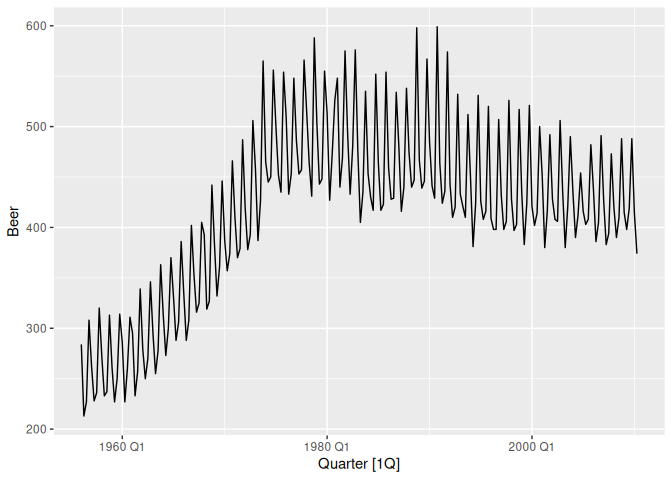
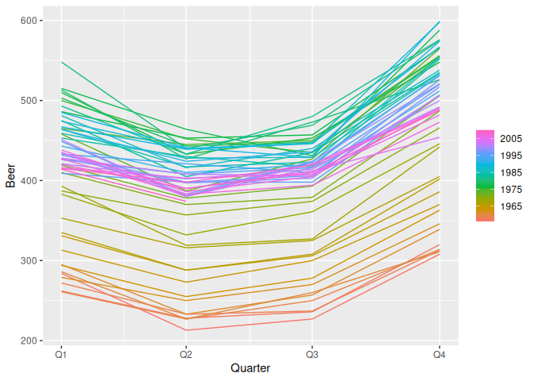

<!-- README.md is generated from README.qmd. Please edit that file -->

# ggtime <a href="https://pkg.mitchelloharawild.com/ggtime/"></a>

<!-- badges: start -->

[](https://lifecycle.r-lib.org/articles/stages.html#experimental)
[](https://CRAN.R-project.org/package=ggtime)
[](https://github.com/mitchelloharawild/ggtime/actions/workflows/R-CMD-check.yaml)
<!-- badges: end -->

The ggtime package extends the capabilities of ‘ggplot2’ by providing
grammatical elements and plot helpers designed for visualizing time
series patterns. These functions use calendar structures implemented in
the mixtime package to help explore common time series patterns
including trend, seasonality, cycles, and holidays.

The plot helper functions make use of the tsibble data format in order
to quickly and easily produce common time series plots. These plots can
also be constructed with the underlying grammar elements, which allows
greater flexibility in producing custom time series visualisations.

## Installation

You can install the **stable** version from
[CRAN](https://cran.r-project.org/package=ggtime):

``` r
install.packages("ggtime")
```

You can install the development version of ggtime from
[GitHub](https://github.com/) with:

``` r
# install.packages("remotes")
remotes::install_github("mitchelloharawild/ggtime")
```

## Examples

The simplest time series visualisation is the time plot, which shows
time continuously on the x-axis with the measured variables on the
y-axis. A time plot is useful for identifying patterns that persist over
a long period of time, such as trends and seasonality. A time plot can
be created from a tsibble with the `autoplot()` helper function.

``` r
library(ggtime)
library(ggplot2)
library(tsibble)

tsibbledata::aus_production |>
  autoplot(Beer)
```



To view the shape of the annual seasonal pattern, it is useful to use a
seasonal plot which shows time cyclically on the x-axis. This makes it
easier to identify the peaks, troughs, and overall shape of the
seasonality. A seasonal plot is created from a tsibble with the
`gg_season()` plot helper function.

``` r
tsibbledata::aus_production |> 
  gg_season(Beer)
```


